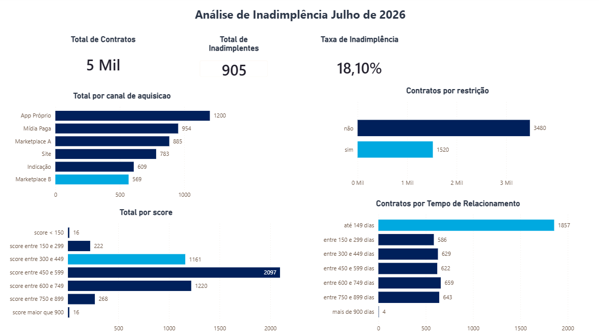

# Análise de Inadimplência em Operações de Crédito
Projeto de análise de dados desenvolvido a partir de uma base fictícia de contratos de empréstimo de uma fintech especializada em crédito para clientes das classes C e D. Os dados utilizados nesta análise pertencem a uma base fictícia de 5.000 contratos de empréstimo fornecida para o desafio técnico. Por motivos de boas práticas e privacidade, o arquivo original de dados foi omitido deste repositório através do

O objetivo é identificar os principais fatores associados à inadimplência, compreender quais perfis concentram maior risco de crédito e propor recomendações que auxiliem a empresa na tomada de decisão.

Durante o projeto serão utilizadas técnicas de análise exploratória, SQL, Python (Pandas) e Power BI para transformar dados em informações estratégicas.

## Objetivo:
Desenvolver um processo analítico capaz de identificar quais características dos clientes estão associadas à inadimplência, fornecendo informações que apoiem decisões de concessão de crédito e contribuam para a redução das perdas financeiras sem comprometer excessivamente o volume de empréstimos aprovados.

## Dashboard

  

* Quantos contratos possuem e quantos deles são inadimplentes
* Qual a taxa de inadimplencia desse clientes 
* Quais os segmentos mais criticos, que possuem maior taxa de inadimplencia e volume 

## Hipóteses Analíticas

Antes da exploração dos dados, foram definidas algumas hipóteses que serão testadas durante a análise.

### Hipótese 1
Clientes com menor score de crédito apresentam maior taxa de inadimplência.

### Hipótese 2
A idade influencia a probabilidade de inadimplência.

### Hipótese 3
O gênero apresenta diferenças relevantes na taxa de inadimplência.

### Hipótese 4
Clientes com menor tempo de relacionamento apresentam maior risco.

### Hipótese 5
O canal de aquisição influencia o comportamento de pagamento.

### Pergunta principal

**Existe um perfil de cliente que concentra uma taxa de inadimplência significativamente superior à média da carteira?** 

## Metodologia

O projeto será desenvolvido seguindo as seguintes etapas:

Compreensão dos dados:

- Estudo do dicionário de dados
- Entendimento das variáveis
- Identificação do problema de negócio

### 2. Importação e validação

Utilização do Python e da biblioteca Pandas para importar a base de dados e realizar verificações de qualidade, incluindo:

- valores nulos
- registros duplicados
- tipos de dados
- consistência das datas
- padronização das informações

### 3. Modelagem dos dados

Importação da base para um banco SQLite, permitindo a realização de consultas SQL e a organização dos dados para análise.

### 4. Análise exploratória

Realização de consultas SQL para identificar:

- taxa geral de inadimplência
- segmentos de maior risco
- relações entre variáveis
- padrões de comportamento dos clientes

### 5. Geração de Insights

Comparação das hipóteses iniciais com os resultados encontrados, apresentando interpretações e recomendações de negócio.

#### Reflexao 1
Clientes com menor score de crédito apresentam maior taxa de inadimplência:
Falso o grupo com o score na faixa de 300 à 449 é o que tem a maior taxa de inadimplencia 

#### Reflexão 2
A idade influencia a probabilidade de inadimplência.
Não tanto, pois existem outros fatores mais influentes, onde o percentual maior era de até 26 anos com 22.66%

#### Reflexão 3
O gênero apresenta diferenças relevantes na taxa de inadimplência.
Não significativa, pois os resultados estavam equilibrados e bem proximo a taxa de 18.10%

#### Reflexão 4
Clientes com menor tempo de relacionamento apresentam maior risco.
Essa hipotese estava certo, pois clientes com relacionamento até 149 dias tem um percentual de inadimplência de 23.10%

#### Reflexão 5
O canal de aquisição influencia o comportamento de pagamento.
Sim tanto que foi um dos fatores mais criticos, sendo o Marketplace B tem um percentual inadimplência de 32.69%

### 6. Visualização

Desenvolvimento de um dashboard no Power BI utilizando consultas SQL e views para facilitar a comunicação dos resultados.

## Tecnologias utilizadas:

* [Python](https://www.python.org/): linguagem de programação
* [Pandas](https://pandas.pydata.org/docs/): exportar dados para analise em Power BI
* [SQLite](https://sqlite.org/): consultar banco de dados
* [PowerBI](https://www.microsoft.com/pt-br/power-platform/products/power-bi/desktop): Apresentação de Dashboard com indicadores